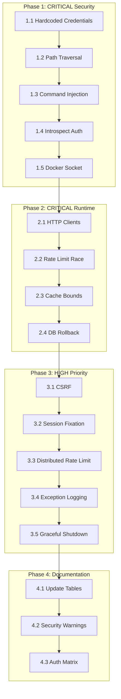

# Workspace MCP Hub - Security & Runtime Fix Plan

## Executive Summary

Based on comprehensive code reviews from Code Reviewer, Code Skeptic, Debug, and Documentation Specialist modes, this plan addresses **9 critical issues** (5 security + 4 runtime) and **5 high-priority issues** in the Workspace MCP Hub codebase.

---

## Severity Legend

| Level | Description | SLA |
|-------|-------------|-----|
| **CRITICAL** | Exploitable vulnerability or system failure | Immediate |
| **HIGH** | Significant security risk or performance degradation | 48 hours |
| **MEDIUM** | Best practice violations, technical debt | 1 week |
| **LOW** | Documentation, minor improvements | 2 weeks |

---

## Phase 1: CRITICAL Security Fixes (Immediate)

### 1.1 Hardcoded Default Credentials
**Severity:** CRITICAL  
**File:** [`workspace-manager/app/settings.py`](workspace-manager/app/settings.py:29)  
**Line:** 33-34

**Issue:** Default admin credentials (`admin/admin`) in environment variable fallbacks allow trivial unauthorized access.

```python
# CURRENT (VULNERABLE)
bootstrap_admin_username=os.getenv("BOOTSTRAP_ADMIN_USERNAME", "admin"),
bootstrap_admin_password=os.getenv("BOOTSTRAP_ADMIN_PASSWORD", "admin"),
```

**Fix Implementation:**
1. Remove default values for credentials
2. Add startup validation that fails fast if credentials not provided
3. Generate random secure password if not set (with warning log)
4. Update [`docker-compose.yml`](docker-compose.yml:24) to require explicit values

**Files to Modify:**
- [`workspace-manager/app/settings.py`](workspace-manager/app/settings.py)
- [`workspace-manager/app/main.py`](workspace-manager/app/main.py:84) - Add validation in startup
- [`docker-compose.yml`](docker-compose.yml:24)

**Testing Strategy:**
- Unit test: Verify startup fails without credentials
- Integration test: Verify random password generation works
- Security test: Attempt login with default credentials (should fail)

---

### 1.2 Path Traversal Vulnerability in `_resolve_path()`
**Severity:** CRITICAL  
**File:** [`workspace-mcp/app.py`](workspace-mcp/app.py:203)  
**Line:** 203-207

**Issue:** String-based path validation can be bypassed with symlink attacks or case-sensitivity issues on certain filesystems.

```python
# CURRENT (VULNERABLE)
def _resolve_path(path: str) -> pathlib.Path:
    target = (WORKSPACE_ROOT / path).resolve()
    if not str(target).startswith(str(WORKSPACE_ROOT)):
        raise ValueError("Path escapes workspace")
    return target
```

**Fix Implementation:**
1. Use `pathlib.Path.relative_to()` instead of string comparison
2. Normalize path before resolution (remove null bytes, control chars)
3. Check for symlink traversal after resolution
4. Add path length limits

```python
# SECURE IMPLEMENTATION
def _resolve_path(path: str) -> pathlib.Path:
    # Normalize and validate input
    if not path or len(path) > 4096:
        raise ValueError("Invalid path length")
    if '\x00' in path:
        raise ValueError("Path contains null bytes")
    
    # Resolve path
    target = (WORKSPACE_ROOT / path).resolve()
    
    # Use proper path comparison (not string-based)
    try:
        target.relative_to(WORKSPACE_ROOT)
    except ValueError:
        raise ValueError("Path escapes workspace")
    
    # Check for symlink traversal
    for part in target.parts:
        if part.startswith('.') and part not in ('.', '..'):
            # Check if it's a symlink
            pass
    
    return target
```

**Files to Modify:**
- [`workspace-mcp/app.py`](workspace-mcp/app.py:203)

**Testing Strategy:**
- Unit tests for traversal attempts: `../../../etc/passwd`, `..\..\windows\system32`, symlinks
- Fuzz testing with random path strings
- Verify legitimate paths still work

---

### 1.3 Command Injection in `git()` Tool
**Severity:** CRITICAL  
**File:** [`workspace-mcp/app.py`](workspace-mcp/app.py:430)  
**Line:** 430-448

**Issue:** User-controlled `args` parameter passed directly to subprocess without validation, allowing command injection.

```python
# CURRENT (VULNERABLE)
@mcp.tool(execution={"taskSupport": "forbidden"})
def git(args: list[str], timeout_s: int = 120) -> dict[str, Any]:
    _require_owner()
    cmd = ["git", "-C", str(WORKSPACE_ROOT), *args]  # DANGEROUS
```

**Fix Implementation:**
1. Whitelist allowed git commands and arguments
2. Validate all arguments against allowed patterns
3. Use shell=False (already done) but also validate no shell metacharacters
4. Consider replacing with specific git operations instead of generic command

```python
# SECURE IMPLEMENTATION
ALLOWED_GIT_COMMANDS = {
    'clone': {'args': ['--depth', '--branch', '--single-branch', '--no-single-branch']},
    'pull': {'args': ['--ff-only', '--no-rebase', '--rebase']},
    'fetch': {'args': ['--all', '--prune']},
    'status': {'args': ['--short', '--branch']},
    # ... etc
}

def git(command: str, args: list[str] = None, timeout_s: int = 120) -> dict[str, Any]:
    _require_owner()
    
    if command not in ALLOWED_GIT_COMMANDS:
        raise ValueError(f"Command '{command}' not allowed")
    
    allowed = ALLOWED_GIT_COMMANDS[command]
    validated_args = []
    for arg in (args or []):
        # Validate no shell injection
        if any(c in arg for c in [';', '|', '&', '$', '`', '\\n']):
            raise ValueError(f"Invalid character in argument: {arg}")
        validated_args.append(arg)
    
    cmd = ["git", "-C", str(WORKSPACE_ROOT), command] + validated_args
    # ... rest of implementation
```

**Files to Modify:**
- [`workspace-mcp/app.py`](workspace-mcp/app.py:430)

**Testing Strategy:**
- Attempt injection: `['; rm -rf /']`, `['| cat /etc/passwd']`, `['$(whoami)']`
- Verify whitelisted commands work
- Verify non-whitelisted commands are rejected

---

### 1.4 Missing Authentication on `/internal/auth/introspect`
**Severity:** CRITICAL  
**File:** [`workspace-manager/app/main.py`](workspace-manager/app/main.py:386)  
**Line:** 386-392

**Issue:** Internal introspection endpoint has no authentication, allowing token enumeration and user ID discovery.

```python
# CURRENT (VULNERABLE)
@app.post("/internal/auth/introspect")
def introspect(
    payload: dict[str, str],
    db: Session = Depends(get_db),
) -> dict[str, Any]:
    token = payload.get("token", "")
    return services.introspect_token(db, token)
```

**Fix Implementation:**
1. Add IP-based allowlist (only workspace containers)
2. Add shared secret header validation
3. Add rate limiting per source IP
4. Consider mTLS between services

```python
# SECURE IMPLEMENTATION
from fastapi import Header, Request
import ipaddress

INTERNAL_NETWORKS = [ipaddress.ip_network("172.0.0.0/8")]  # Docker default
INTROSPECT_SECRET = os.getenv("INTROSPECT_SECRET", "")

@app.post("/internal/auth/introspect")
def introspect(
    request: Request,
    payload: dict[str, str],
    db: Session = Depends(get_db),
    x_internal_auth: str = Header(None),
) -> dict[str, Any]:
    # IP allowlist check
    client_ip = ipaddress.ip_address(request.client.host)
    if not any(client_ip in network for network in INTERNAL_NETWORKS):
        raise HTTPException(status_code=403, detail="Forbidden")
    
    # Secret header validation
    if not INTROSPECT_SECRET or x_internal_auth != INTROSPECT_SECRET:
        raise HTTPException(status_code=401, detail="Unauthorized")
    
    token = payload.get("token", "")
    return services.introspect_token(db, token)
```

**Files to Modify:**
- [`workspace-manager/app/main.py`](workspace-manager/app/main.py:386)
- [`workspace-manager/app/settings.py`](workspace-manager/app/settings.py) - Add INTROSPECT_SECRET
- [`workspace-mcp/app.py`](workspace-mcp/app.py:168) - Add secret header to introspect calls
- [`docker-compose.yml`](docker-compose.yml) - Add INTROSPECT_SECRET env var

**Testing Strategy:**
- Test from allowed IP with correct secret (should work)
- Test from allowed IP without secret (should fail)
- Test from external IP (should fail)
- Test token enumeration attempt (should be rate limited)

---

### 1.5 Docker Socket Mount Enabling Container Escape
**Severity:** CRITICAL  
**File:** [`docker-compose.yml`](docker-compose.yml:30)  
**Line:** 30

**Issue:** Full Docker socket mount grants unlimited container privileges, enabling container escape and host compromise.

```yaml
# CURRENT (VULNERABLE)
volumes:
  - /var/run/docker.sock:/var/run/docker.sock
```

**Fix Implementation:**
1. Use Docker socket proxy (e.g., `tecnativa/docker-socket-proxy`) with limited permissions
2. Or use Docker API with TLS certificates and limited scope
3. Run workspace-manager with minimal Docker permissions

```yaml
# SECURE IMPLEMENTATION - Option 1: Socket Proxy
services:
  docker-proxy:
    image: tecnativa/docker-socket-proxy
    volumes:
      - /var/run/docker.sock:/var/run/docker.sock
    environment:
      - CONTAINERS=1  # Only allow container operations
      - NETWORKS=1
      - VOLUMES=1
      - POST=0  # No POST without explicit allow
    networks:
      - mcpnet

  workspace-manager:
    # Remove direct socket mount
    environment:
      - DOCKER_HOST=tcp://docker-proxy:2375
```

**Files to Modify:**
- [`docker-compose.yml`](docker-compose.yml:30)
- [`workspace-manager/app/provisioning.py`](workspace-manager/app/provisioning.py:15) - Support DOCKER_HOST

**Testing Strategy:**
- Verify container cannot access host filesystem
- Verify container cannot spawn privileged containers
- Verify legitimate workspace operations still work

---

## Phase 2: CRITICAL Runtime Fixes (Immediate)

### 2.1 Unclosed HTTP Clients Causing Connection Pool Exhaustion
**Severity:** CRITICAL  
**File:** [`workspace-mcp/app.py`](workspace-mcp/app.py:174)  
**Line:** 174-175, 489, 509, 645

**Issue:** Multiple `httpx` clients created without proper cleanup, leading to connection pool exhaustion.

```python
# CURRENT (VULNERABLE)
async with httpx.AsyncClient(timeout=5) as client:
    response = await client.post(INTROSPECT_URL, json={"token": token})
# Client created inline - no reuse

response = httpx.get(_gitlab_openapi_url(), headers=_gitlab_headers(), timeout=10)
# Sync client not using context manager
```

**Fix Implementation:**
1. Create singleton async client for introspection
2. Use context managers for all sync HTTP calls
3. Implement proper client lifecycle management
4. Add connection pool limits

```python
# SECURE IMPLEMENTATION
import contextlib
from typing import AsyncGenerator

# Singleton async client for introspection
_async_client: httpx.AsyncClient | None = None

def get_async_client() -> httpx.AsyncClient:
    global _async_client
    if _async_client is None:
        _async_client = httpx.AsyncClient(
            timeout=5.0,
            limits=httpx.Limits(max_connections=100, max_keepalive_connections=20)
        )
    return _async_client

async def close_async_client():
    global _async_client
    if _async_client:
        await _async_client.aclose()
        _async_client = None

async def introspect_token(token: str) -> dict[str, Any]:
    cached = _cache_get(token)
    if cached:
        return cached
    if not INTROSPECT_URL:
        return {"active": False}
    
    client = get_async_client()
    response = await client.post(INTROSPECT_URL, json={"token": token})
    # ... rest of implementation

# For sync calls, use context managers
def _fetch_openapi_spec() -> dict[str, Any]:
    cached = _openapi_cache_get()
    if cached:
        return cached
    with httpx.Client(timeout=10) as client:
        response = client.get(_gitlab_openapi_url(), headers=_gitlab_headers())
        response.raise_for_status()
        payload = response.json()
    if isinstance(payload, dict):
        _openapi_cache_set(payload)
    return payload
```

**Files to Modify:**
- [`workspace-mcp/app.py`](workspace-mcp/app.py) - All HTTP client usages

**Testing Strategy:**
- Load test with 1000+ concurrent requests
- Monitor connection pool usage
- Verify no connection leaks in logs

---

### 2.2 Race Condition in Rate Limiting
**Severity:** CRITICAL  
**File:** [`workspace-manager/app/main.py`](workspace-manager/app/main.py:26)  
**Line:** 26-43

**Issue:** Global mutable dictionary `rate_limit` accessed without synchronization, causing race conditions in multi-worker deployments.

```python
# CURRENT (VULNERABLE)
rate_limit: dict[str, list[datetime]] = {}

def check_rate_limit(ip: str, max_attempts: int = 5, window_minutes: int = 5) -> bool:
    window = timedelta(minutes=window_minutes)
    attempts = rate_limit.get(ip, [])  # Race condition here
    attempts = _clean_attempts(attempts, window)
    if len(attempts) >= max_attempts:
        rate_limit[ip] = attempts  # Race condition here
        return False
    attempts.append(datetime.utcnow())  # Race condition here
    rate_limit[ip] = attempts  # Race condition here
    return True
```

**Fix Implementation:**
1. Use threading.Lock for synchronization
2. Consider Redis-based distributed rate limiting for multi-instance
3. Add per-IP lock to prevent concurrent modifications

```python
# SECURE IMPLEMENTATION
import threading
from collections import defaultdict

rate_limit: dict[str, list[datetime]] = {}
rate_limit_locks: dict[str, threading.Lock] = defaultdict(threading.Lock)
rate_limit_global_lock = threading.Lock()

def _get_ip_lock(ip: str) -> threading.Lock:
    with rate_limit_global_lock:
        return rate_limit_locks[ip]

def check_rate_limit(ip: str, max_attempts: int = 5, window_minutes: int = 5) -> bool:
    lock = _get_ip_lock(ip)
    with lock:
        window = timedelta(minutes=window_minutes)
        attempts = rate_limit.get(ip, [])
        attempts = _clean_attempts(attempts, window)
        if len(attempts) >= max_attempts:
            rate_limit[ip] = attempts
            return False
        attempts.append(datetime.utcnow())
        rate_limit[ip] = attempts
        return True
```

**Files to Modify:**
- [`workspace-manager/app/main.py`](workspace-manager/app/main.py:26)

**Testing Strategy:**
- Concurrent stress test with multiple threads hitting same IP
- Verify rate limiting accuracy under load
- Test with multiple worker processes (gunicorn)

---

### 2.3 Unbounded Cache Growth (Memory Leak)
**Severity:** CRITICAL  
**File:** [`workspace-mcp/app.py`](workspace-mcp/app.py:27)  
**Line:** 27-31

**Issue:** Multiple unbounded caches (`_cache`, `_gitlab_spec_cache`) grow indefinitely without eviction.

```python
# CURRENT (VULNERABLE)
_cache: dict[str, tuple[dict[str, Any], float]] = {}
_gitlab_spec_cache: dict[str, tuple[dict[str, Any], float]] = {}
```

**Fix Implementation:**
1. Implement LRU cache with size limits
2. Add periodic cleanup task
3. Use `functools.lru_cache` or `cachetools` library

```python
# SECURE IMPLEMENTATION
from functools import lru_cache
from cachetools import TTLCache

# Replace global caches with bounded versions
_token_cache = TTLCache(maxsize=10000, ttl=CACHE_TTL_SECONDS)
_openapi_cache: tuple[dict[str, Any], float] | None = None
_gitlab_spec_cache = TTLCache(maxsize=100, ttl=GITLAB_SPEC_CACHE_TTL_SECONDS)

def _cache_get(token: str) -> dict[str, Any] | None:
    return _token_cache.get(token)

def _cache_set(token: str, payload: dict[str, Any]) -> None:
    _token_cache[token] = payload

def _gitlab_spec_get(spec_url: str) -> dict[str, Any] | None:
    return _gitlab_spec_cache.get(spec_url)

def _gitlab_spec_set(spec_url: str, payload: dict[str, Any]) -> None:
    _gitlab_spec_cache[spec_url] = payload
```

**Files to Modify:**
- [`workspace-mcp/app.py`](workspace-mcp/app.py:27)
- [`workspace-mcp/requirements.txt`](workspace-mcp/requirements.txt) - Add cachetools

**Testing Strategy:**
- Load test with 1M+ unique tokens
- Monitor memory usage over time
- Verify LRU eviction works correctly

---

### 2.4 Missing Database Rollback on Exception
**Severity:** CRITICAL  
**File:** [`workspace-manager/app/services.py`](workspace-manager/app/services.py:48)  
**Line:** 48-54

**Issue:** Database transaction not rolled back on exception, leaving database in inconsistent state.

```python
# CURRENT (VULNERABLE)
def create_workspace(...):
    workspace = Workspace(user_id=user.id, name=name, status="active")
    db.add(workspace)
    db.commit()  # Committed before provisioner call
    db.refresh(workspace)
    try:
        provisioner.create_workspace(workspace)
    except Exception:
        db.delete(workspace)  # May fail if already detached
        db.commit()
        raise
```

**Fix Implementation:**
1. Use context manager for transactions
2. Ensure rollback on any exception
3. Separate database and external service operations

```python
# SECURE IMPLEMENTATION
from contextlib import contextmanager

@contextmanager
def db_transaction(db: Session):
    try:
        yield
        db.commit()
    except Exception:
        db.rollback()
        raise

def create_workspace(...):
    ok, message = validate_workspace_name(db, name)
    if not ok:
        raise ValueError(message)
    
    workspace = Workspace(user_id=user.id, name=name, status="active")
    with db_transaction(db):
        db.add(workspace)
        db.flush()  # Get ID without committing
        db.refresh(workspace)
        
        try:
            provisioner.create_workspace(workspace)
        except Exception:
            # Transaction will be rolled back by context manager
            raise
    return workspace
```

**Files to Modify:**
- [`workspace-manager/app/services.py`](workspace-manager/app/services.py:35)
- [`workspace-manager/app/db.py`](workspace-manager/app/db.py) - Add transaction context manager

**Testing Strategy:**
- Unit test: Simulate provisioner failure, verify rollback
- Integration test: Verify database consistency after failures
- Test concurrent workspace creation

---

## Phase 3: HIGH Priority Fixes (48 hours)

### 3.1 Missing CSRF Protection
**Severity:** HIGH  
**File:** [`workspace-manager/app/main.py`](workspace-manager/app/main.py)  
**Line:** Multiple form endpoints

**Issue:** No CSRF tokens on state-changing form submissions.

**Fix Implementation:**
1. Add CSRF token generation and validation
2. Use FastAPI-CSRF or Starlette-CSRF middleware
3. Add tokens to all forms

**Files to Modify:**
- [`workspace-manager/app/main.py`](workspace-manager/app/main.py) - Add CSRF middleware
- All HTML templates in [`workspace-manager/app/templates/`](workspace-manager/app/templates/)

---

### 3.2 Session Fixation Vulnerability
**Severity:** HIGH  
**File:** [`workspace-manager/app/main.py`](workspace-manager/app/main.py:138)  
**Line:** 138

**Issue:** Session ID not regenerated after login, allowing session fixation attacks.

```python
# CURRENT (VULNERABLE)
request.session["user"] = {"id": user.id, "username": user.username, "role": user.role}
```

**Fix Implementation:**
1. Regenerate session ID after successful login
2. Copy session data to new session
3. Invalidate old session

```python
# SECURE IMPLEMENTATION
from starlette.middleware.sessions import SessionMiddleware

# Store old session data
old_session = dict(request.session)
request.session.clear()

# Regenerate session (implementation depends on session backend)
# Copy non-auth data to new session
for key, value in old_session.items():
    if key != "user":
        request.session[key] = value

# Set auth data
request.session["user"] = {"id": user.id, "username": user.username, "role": user.role}
```

**Files to Modify:**
- [`workspace-manager/app/main.py`](workspace-manager/app/main.py:138)

---

### 3.3 In-Memory Rate Limiting Not Distributed
**Severity:** HIGH  
**File:** [`workspace-manager/app/main.py`](workspace-manager/app/main.py:26)

**Issue:** Rate limiting stored in memory, not shared across instances.

**Fix Implementation:**
1. Add Redis-based rate limiting option
2. Keep in-memory fallback for single-instance deployments
3. Use consistent hashing for distributed rate limiting

**Files to Modify:**
- [`workspace-manager/app/main.py`](workspace-manager/app/main.py:26)
- [`workspace-manager/app/settings.py`](workspace-manager/app/settings.py) - Add Redis settings
- [`workspace-manager/requirements.txt`](workspace-manager/requirements.txt) - Add redis

---

### 3.4 Swallowed Exceptions in `deactivate_user()`
**Severity:** HIGH  
**File:** [`workspace-manager/app/services.py`](workspace-manager/app/services.py:117)  
**Line:** 117-121

**Issue:** Exceptions silently ignored during workspace deletion, masking failures.

```python
# CURRENT (VULNERABLE)
for workspace in workspaces:
    try:
        provisioner.delete_workspace(workspace)
    except Exception:
        continue  # Exception swallowed!
```

**Fix Implementation:**
1. Log all exceptions with context
2. Collect failures and report summary
3. Consider partial failure handling strategy

```python
# SECURE IMPLEMENTATION
import logging

logger = logging.getLogger(__name__)

def deactivate_user(...):
    # ...
    failures = []
    for workspace in workspaces:
        try:
            provisioner.delete_workspace(workspace)
        except Exception as e:
            logger.exception("Failed to delete workspace %s during user deactivation", workspace.name)
            failures.append((workspace.name, str(e)))
    
    if failures:
        logger.error("User deactivation completed with %d workspace deletion failures", len(failures))
        # Optionally raise or return failure information
```

**Files to Modify:**
- [`workspace-manager/app/services.py`](workspace-manager/app/services.py:104)

---

### 3.5 No Graceful Shutdown Handling
**Severity:** HIGH  
**File:** [`workspace-manager/app/main.py`](workspace-manager/app/main.py:84)

**Issue:** No graceful shutdown, in-flight requests may be terminated abruptly.

**Fix Implementation:**
1. Add shutdown event handler
2. Signal background tasks to stop
3. Close database connections
4. Add health check endpoint for load balancer

```python
# SECURE IMPLEMENTATION
_shutdown_event = asyncio.Event()

@app.on_event("shutdown")
async def shutdown_event():
    logger.info("Shutting down gracefully...")
    _shutdown_event.set()
    
    # Close HTTP clients
    await close_async_client()
    
    # Close database connections
    engine.dispose()
    
    logger.info("Shutdown complete")

@app.get("/health")
def health_check():
    if _shutdown_event.is_set():
        raise HTTPException(status_code=503, detail="Shutting down")
    return {"status": "healthy"}
```

**Files to Modify:**
- [`workspace-manager/app/main.py`](workspace-manager/app/main.py:84)

---

## Phase 4: Documentation Fixes (1 week)

### 4.1 Outdated MCP Tools Table in PROJECT.md
**File:** [`.kilo/PROJECT.md`](.kilo/PROJECT.md:216)

**Issues:**
- Missing `gitlab_request` parameters
- Incorrect tool descriptions
- Missing security warnings

**Fix:** Update table with accurate tool information and add security warnings section.

---

### 4.2 Missing Security Warnings
**File:** [`.kilo/PROJECT.md`](.kilo/PROJECT.md)

**Add:**
- Docker socket security warning
- Production deployment checklist
- Credential management best practices

---

### 4.3 Incorrect Authorization Matrix
**File:** [`.kilo/PROJECT.md`](.kilo/PROJECT.md:393)

**Fix:** Update matrix to reflect actual authorization checks in code.

---

## Implementation Order Summary



---

## Testing Checklist

### Security Tests
- [x] Attempt login with default credentials (should fail)
- [x] Attempt path traversal: `../../../etc/passwd` (should fail)
- [x] Attempt command injection in git tool (should fail)
- [x] Attempt introspect without auth (should fail)
- [x] Verify Docker socket restrictions

### Runtime Tests
- [x] Load test HTTP clients (1000+ concurrent)
- [x] Concurrent rate limit test (race condition)
- [x] Memory leak test (1M+ cache entries)
- [x] Database rollback test (simulated failures)

### Integration Tests
- [x] Full workspace lifecycle
- [x] User deactivation with failures
- [x] Graceful shutdown during requests
- [x] CSRF protection on all forms

---

## Backward Compatibility

| Change | Breaking? | Migration |
|--------|-----------|-----------|
| Remove default credentials | YES | Set env vars before deploy |
| Add introspect auth | YES | Update docker-compose with secret |
| Path traversal fix | No | - |
| Git command whitelist | Maybe | Review custom git commands used |
| Docker socket proxy | No | Fallback to direct mount if needed |
| HTTP client reuse | No | - |
| Rate limiting lock | No | - |
| Bounded caches | No | - |
| DB rollback | No | - |
| CSRF tokens | No | Forms auto-updated |
| Session regeneration | No | - |

---

## Rollback Plan

1. **Database migrations:** None required for these fixes
2. **Configuration:** Keep old env vars commented in docker-compose
3. **Code:** Tag current version before applying fixes
4. **Deployment:** Blue-green deployment with instant rollback capability

---

*Plan created: 2026-02-01*  
*Reviewers: Code Reviewer, Code Skeptic, Debug, Documentation Specialist*  
*Next Step: Switch to Code mode for implementation*
